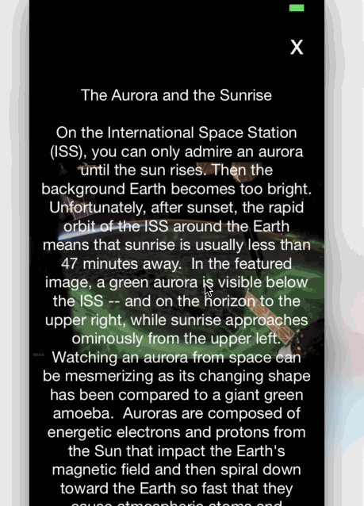

# NASADailyPic

This project is an example about how to use [NASA's Astronomy Picture of the Day(APOD) API](https://api.nasa.gov/index.html).

## Third-party libraries
[Alamofire](https://github.com/Alamofire/Alamofire) was used for the API Request and [SDWebImage](https://github.com/rs/SDWebImage) was used for download the picture of the day.
Both libraries were installed using [CocoaPods](https://cocoapods.org)

  

